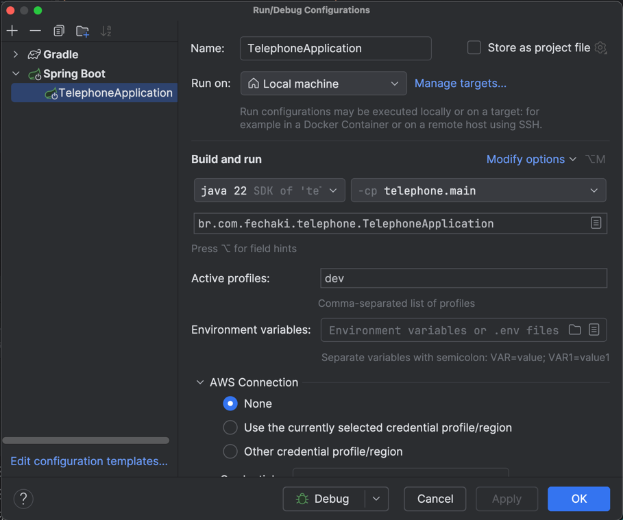

# Fechaki - Telephone Module

## Getting Started
This Module uses Spring Boot with Postgres and RabbitMQ. It has an integration with [Numverify API](https://numverify.com/).
This project contains a Docker Compose file named `compose.yaml`, with the needed services defined

Before run this application locally, you need to define the follow environment variables:
* Developer Environment (DEV):
  * TELEPHONE_DATASOURCE_PASSWORD
  * TELEPHONE_DATASOURCE_URL
  * TELEPHONE_DATASOURCE_USERNAME
  * TELEPHONE_RABBITMQ_USERNAME
  * TELEPHONE_RABBITMQ_PASSWORD
  * TELEPHONE_NUMVERIFY_ACCESS_KEY
* User Acceptance Testing Environment (UAT):
    * TELEPHONE_DATASOURCE_PASSWORD_UAT
    * TELEPHONE_DATASOURCE_URL_UAT
    * TELEPHONE_DATASOURCE_USERNAME_UAT
    * TELEPHONE_RABBITMQ_USERNAME_UAT
    * TELEPHONE_RABBITMQ_PASSWORD_UAT
    * TELEPHONE_NUMVERIFY_ACCESS_KEY_UAT
* Production Environment (PRD):
    * TELEPHONE_DATASOURCE_PASSWORD_PRD
    * TELEPHONE_DATASOURCE_URL_PRD
    * TELEPHONE_DATASOURCE_USERNAME_PRD
    * TELEPHONE_RABBITMQ_USERNAME_PRD
    * TELEPHONE_RABBITMQ_PASSWORD_PRD
    * TELEPHONE_NUMVERIFY_ACCESS_KEY_PRD

These are the default values for Developer Environment Variables:

| NAME                           | VALUE                                                             |
|--------------------------------|-------------------------------------------------------------------|
| TELEPHONE_DATASOURCE_PASSWORD  | s3cr3t                                                            |
| TELEPHONE_DATASOURCE_URL       | jdbc:postgresql://localhost:5432/telephonedb                      |
| TELEPHONE_DATASOURCE_USERNAME  | user                                                              |
| TELEPHONE_RABBITMQ_USERNAME    | user                                                              |
| TELEPHONE_RABBITMQ_PASSWORD    | s3cr3t                                                            |
| TELEPHONE_NUMVERIFY_ACCESS_KEY | Need to Generate on [Numverify API Panel](https://numverify.com/) |

### Project execution
After creating the Environment variables, make sure you have Docker installed and running.
Set the active profile as ```dev``` and run

